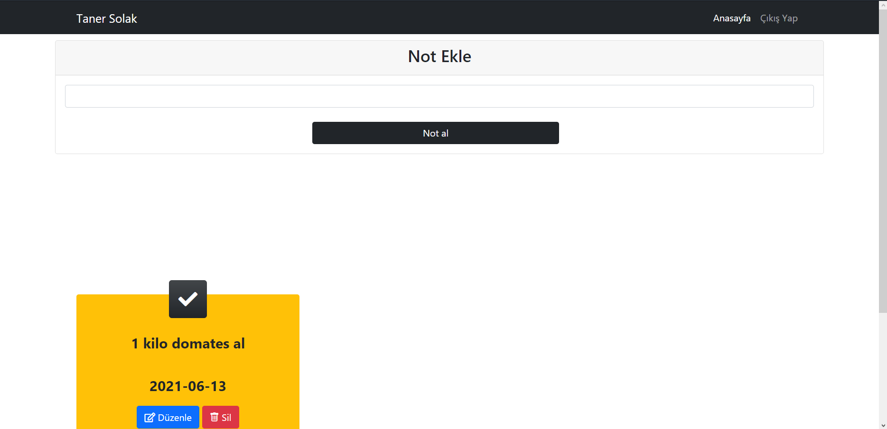
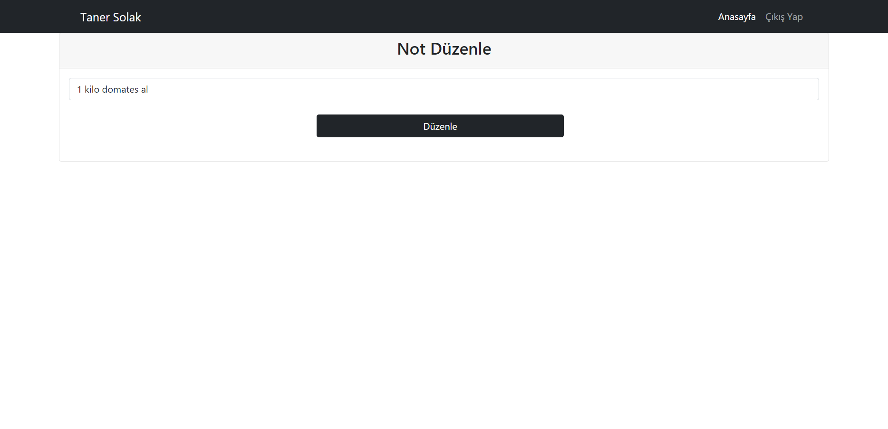

# Online Not Defteri 
[Site Linki](http://notdefteri.eu5.org)

# Özet
Bursa Teknik Üniversitesi Web Tabanlı Programlama Dilleri dersi için PHP ve MySql projesi.
## Amaç
Kullanıcıların internete bağlı herhangi bir cihazdan kendi notlarını görebilmesini sağlamak.

# Kullanılan Teknolojiler
- HTML
- CSS
- PHP
- MySql

## Nasıl Kullanılır?
- Kaydolma ekranında istenen bilgileri girerek kaydolunuz.

- Kaydolduktan sonra hesabınıza giriş yapabilirsiniz.

- Anasayfada önceden yazdığınız notlar listelenir ve yenisini yazabileceğiniz bölüm bulunmaktadır. Önceki notlarınızı düzenleyebilir veya silebilirsiniz.

 
- Düzenleme ekranı bu şekildedir.

 
# İletişim
[Linkedin](https://www.linkedin.com/in/taner-solak-aa30b91b4/)
